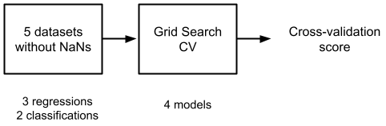
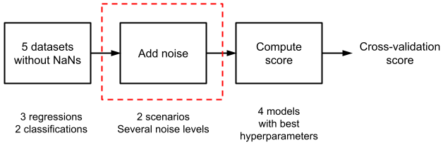
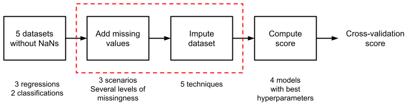
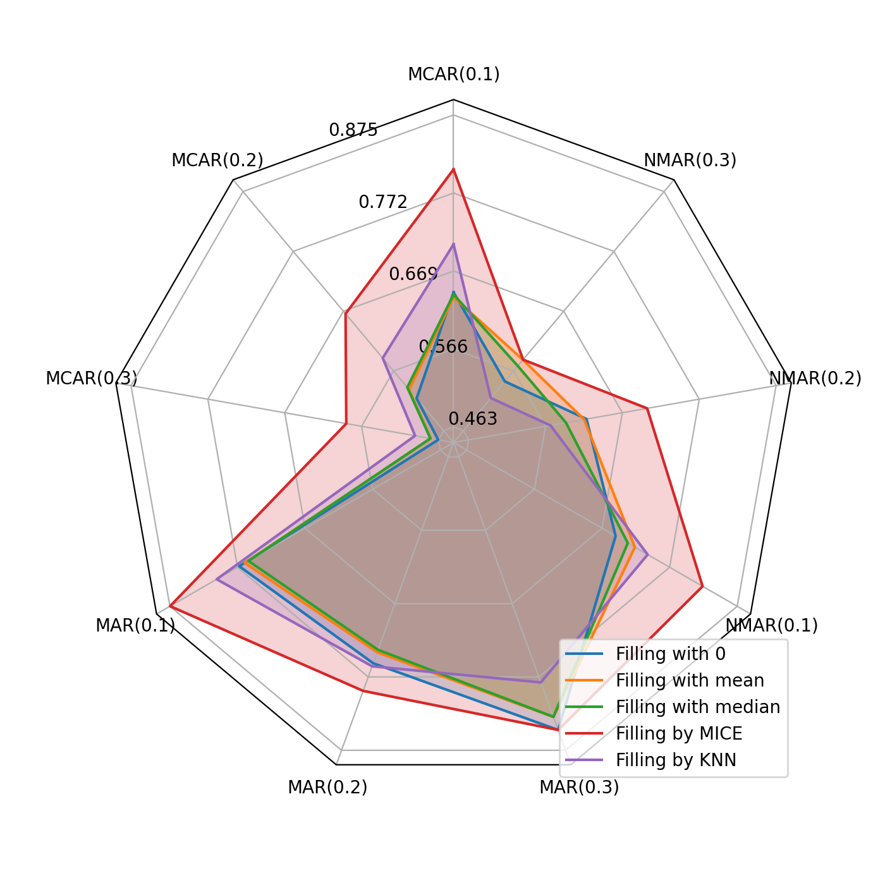
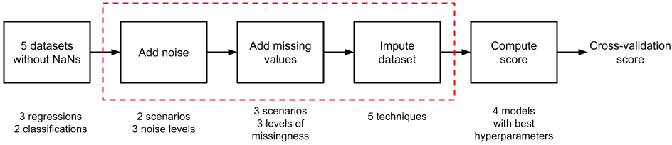

# Missing values and noise in data. How crucial it can be?
This repository contains reproducible `python` source code for the final project of the team *Do not miss your value* at Skoltech [Machine Learning course](https://github.com/adasegroup/ML2022_lectures). Team members: 
- Vladislav Molodtsov
- Irina Shushpannikova
- Stepan Vasilev
- Kelvin Kutsukutsa
- Zhadyraiym Akunova

## Repository structure
All the experiments are issued in the form of pretty self-explanatory jupyter notebooks. For convenience, raw and processed datasets used in the experiments are placed in this repository as well. The structure of the repository should be preserved in order to run all code in notebooks without changing relative paths to the files. Obtained results are included into repository as `.csv` files and `.png` graphs and diagrams. For proper display of the pictures in this README, we recommend to switch to the Light theme in GitHub settings.

### Code
- `Data preprocessing.ipynb` -- preprocessing of raw datasets: drop missing values and useless columns, rename target as `Target`;
- `Experiments.ipynb` -- main code for the pipelines of experiments; contains all implemented functions for adding noise, introducing missing values, imputing missing values, evaluating models and so on;
- `Results processing.ipynb` -- notebook for processing obtained results and building graphs and diagrams;

### Datasets
- `/Raw datasets` -- raw datasets for both regression and classification problems with links to the sources;
- `/Datasets` -- processed datasets for both regression and classification problems; for convenience, the directory is divided into two parts: `Classification` with datasets for classification problem and `Regression` with datasets for regression problem; in total, there are 2 datasets for classification and 3 datasets for classification.

#### Table with the description of the datasets

| # |        Dataset name       |     Problem    |                   Description                   |    Shape   |                Target                |
|:-:|:-----------------:|:--------------:|:-----------------------------------------------:|:----------:|:------------------------------------:|
| 1 |  [Air temperatures](https://archive.ics.uci.edu/ml/datasets/Bias+correction+of+numerical+prediction+model+temperature+forecast) |   Regression   |     Predict air temperature by external data    | (7588, 23) |    Min value  17.4 Max value  38.9   |
| 2 |    [Air quality](https://archive.ics.uci.edu/ml/datasets/Air+Quality)    |   Regression   |       Identify air quality by sensors data      |  (827, 13) |     Min value  0.4 Max value 1.5     |
| 3 | [Parkinson disease](https://archive.ics.uci.edu/ml/datasets/Parkinsons+Telemonitoring) |   Regression   | Predict Parkinson disease by voice measurements | (5875, 22) |       Min value 7 Max value  55      |
| 4 |    [Wine quality](https://archive.ics.uci.edu/ml/datasets/wine+quality)   | Classification |  Identify wine quality by physicochemical tests | (4898, 12) |  7 classes, from 5 to 2198 elements  |
| 5 |  [Robot's sensors](https://archive.ics.uci.edu/ml/datasets/Wall-Following+Robot+Navigation+Data)  | Classification |          Predict action by sensors data         | (5455, 25) | 4 classes, from 328 to 2205 elements |

### Results
- `/Results` -- `.csv` files with the results of carried out experiments; contains 3 files: `results_noise_only.csv` for experiments with noise only, `results_drop_only.csv` for experiments with missing values only, and `results_noise_and_drop.csv` for experiments with both noise and missing values;
- `/Graphs` -- `.png` files with graphs and diagrams reflecting the results of the experiments; there are 4 families of pictures: 
1. `noise_reg_T_dataset_N_M.png` -- dependency of models score on the noise level in the dataset, where `T` is `True` for regression and `False` for classification, `N` is number of dataset, `M` is `SNR` for Additive White Gaussian Noise (AWGN) added to the dataset or `p` for random changing every value in the dataset to the other one;
2. `drop4model_reg_T_dataset_N_drop_L_model_K.png` -- dependency of distortion metrics on the rate of introduced missing values , where `L` is `1`, `2`, or `3` for different missing scenarios (Missing Completely At Random (MCAR), Missing At Random (MAR), Not Missing At Random (NMAR), respectively), `K` is ML model number;
3. `drop_diagram_reg_T_dataset_N.png` -- radar diagrams for comparing different imputation methods in different missing scenarios;
4. `noisy_drop_diagram_reg_T_dataset_N_noise_Z_S.png` -- radar diagrams for comparing different imputation methods in different missing scenarios with different level of noise, where `Z` is `1` for AWGN and `2` for random changing, `S` is level of noise in decibels or in dropping probability, respectively.

## Experiments
### Pipeline 1/4 -- experiments with initial datasets without distortions

#### Table with scores on initial datasets without distortion (cross-validation score is depicted):

|   | Dataset name      | Problem         | Score name | Linear | DT   | RF   | LightGBM |
|---|-------------------|-----------------|------------|--------|------|------|----------|
| 1 | [Air temperatures](https://archive.ics.uci.edu/ml/datasets/Bias+correction+of+numerical+prediction+model+temperature+forecast)  | Regression      | MAPE       | 0.04   | 0.05 | 0.04 | 0.04     |
| 2 | [Air quality](https://archive.ics.uci.edu/ml/datasets/Air+Quality)       | Regression      | MAPE       | 0.06   | 0.10 | 0.08 | 0.06     |
| 3 | [Parkinson disease](https://archive.ics.uci.edu/ml/datasets/Parkinsons+Telemonitoring) | Regression      | MAPE       | 0.11   | 0.12 | 0.11 | 0.11     |
| 4 | [Wine quality](https://archive.ics.uci.edu/ml/datasets/wine+quality)      | Classification  | F1-micro   | 0.52   | 0.51 | 0.53 | 0.52     |
| 5 | [Robot’s sensors](https://archive.ics.uci.edu/ml/datasets/Wall-Following+Robot+Navigation+Data)   | Classificationч | F1-micro   | 0.68   | 0.98 | 0.99 | 0.99     |

### Pipeline 2/4 -- experiments with datasets containing only noise

#### Dependency of cross-validation score on noise level (left -- AWGN, right -- random changing):

  
   

### Pipeline 3/4 -- experiments with datasets containing only missing values

#### Dependency of distortion metrics on dropping level (left -- Decision tree, right -- Random Forest):

  
   

#### Radar diagram for comparing different imputation methods in different missing scenarios:

### Pipeline 4/4 -- experiments with datasets containing both noise and missing values

#### Radar diagrams for comparing different imputation methods in different missing scenarios with different level of noise:

  
   

## Credits
- [miceforest](https://github.com/AnotherSamWilson/miceforest.git) - MICE implemetation;
- [adasegroup](https://github.com/adasegroup) - ML course at Skoltech;
- [Wasserstein2GenerativeNetworks](https://github.com/iamalexkorotin/Wasserstein2GenerativeNetworks/) - used example of good repo structure;
